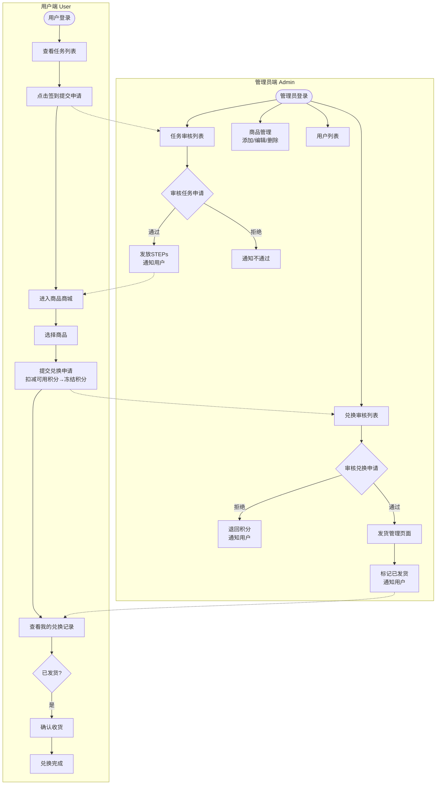
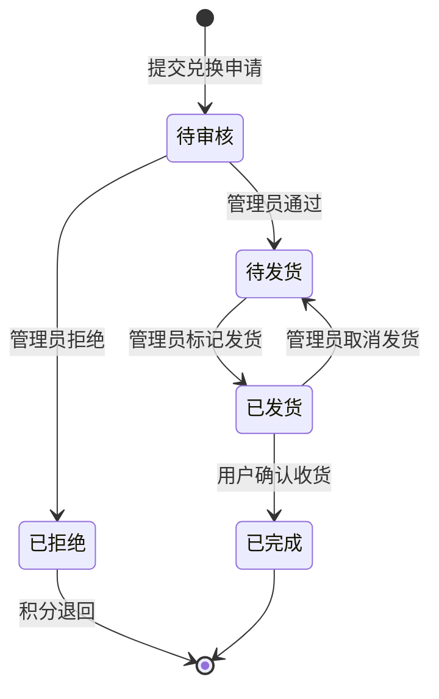

# 积分兑换系统 PRD

| 版本 | 日期 | 作者 | 变更说明 |
|------|------|------|----------|
| v1.0 | 2025-03-03 | Claude | 初始版本 |

---

## 1. 项目概述

### 1.1 项目背景

本项目旨在构建一个积分兑换系统，用户可以通过完成每日签到任务获取STEPs积分，并使用积分兑换商品。系统包含用户端和管理员端，支持任务审核、商品兑换、发货管理等完整流程。

### 1.2 核心功能

- 用户注册登录（管理员创建账号）
- 每日签到任务获取STEPs
- 商品浏览与兑换
- 管理员审核任务与订单
- 商品与用户管理

### 1.3 用户角色

| 角色 | 说明 |
|------|------|
| 普通用户 | 完成任务获取积分，兑换商品 |
| 管理员 | 审核任务、管理订单、维护商品和用户 |

---

## 2. 用户旅程地图

---

## 3. 订单状态流转

---

## 4. 用户故事

### 阶段一：角色与权限

#### US-01: 创建用户账号（管理员）

**作为** 一名管理员
**我想要** 创建新用户账号
**以便** 分发给需要使用系统的用户

**业务规则：**

| 规则项 | 内容 |
|--------|------|
| 必填字段 | 邮箱、姓名、密码 |
| 初始积分 | 默认为 0 |
| 账号状态 | 默认启用 |
| 重复校验 | 邮箱唯一，重复时提示"该邮箱已被注册" |

**验收标准：**

- [ ] 管理员可以填写邮箱、姓名、密码创建用户
- [ ] 新用户初始积分为0，状态为启用
- [ ] 邮箱重复时给出明确提示
- [ ] 创建成功后列表自动刷新显示新用户

---

#### US-02: 用户登录

**作为** 一名已注册用户
**我想要** 使用邮箱和密码登录
**以便** 进入系统使用积分兑换功能

**业务规则：**

| 规则项 | 内容 |
|--------|------|
| 登录方式 | 邮箱 + 密码 |
| 错误锁定 | 5次密码错误后账号锁定30分钟 |
| 记住我 | 勾选后7天内保持登录状态 |
| 登录后跳转 | 商品商城页 |

**验收标准：**

- [ ] 用户可以使用邮箱+密码登录
- [ ] 登录成功后跳转到商城页
- [ ] 密码错误5次后账号锁定30分钟
- [ ] 锁定期间显示明确提示
- [ ] "记住我"勾选后7天内保持登录

---

#### US-03: 管理员登录

**作为** 一名管理员
**我想要** 登录管理后台
**以便** 审核任务、管理订单和商品

**业务规则：**

| 规则项 | 内容 |
|--------|------|
| 登录入口 | 与普通用户共用登录页面 |
| 角色区分 | 用户表中 `role` 字段（`user` / `admin`） |
| 登录后跳转 | 积分管理页面（管理员后台首页） |
| 错误锁定 | 密码错误不锁定，可无限次尝试 |

**验收标准：**

- [ ] 管理员可以使用与用户相同的登录页面
- [ ] 登录成功后根据 `role` 字段跳转不同页面
- [ ] 普通用户跳转到商城页
- [ ] 管理员跳转到积分管理页
- [ ] 管理员账号密码错误不锁定

---

#### US-04: 退出登录

**作为** 一名已登录用户
**我想要** 退出登录
**以便** 安全地离开系统

**业务规则：**

| 规则项 | 内容 |
|--------|------|
| 退出后跳转 | 登录页面 |
| 二次确认 | 需要弹窗确认，防止误操作 |
| 清除状态 | 清除登录状态和"记住我"凭证 |

**验收标准：**

- [ ] 点击"退出登录"弹出确认框
- [ ] 确认后清除登录状态
- [ ] 退出后跳转到登录页
- [ ] 清除"记住我"的凭证，下次需要重新登录

---

### 阶段二：任务与积分

#### US-05: 查看任务列表

**作为** 一名普通用户
**我想要** 查看每日可完成的任务列表
**以便** 了解可以获取哪些积分奖励

**业务规则：**

| 规则项 | 内容 |
|--------|------|
| 任务类型 | 每日签到（后续可扩展其他任务） |
| 积分奖励 | 由管理员设定（系统预设） |
| 完成状态 | 已完成显示✓，今日已完成不可重复提交 |
| 任务重置 | 每日0点重置，签到任务每天可做一次 |
| 排序规则 | 按任务创建时间先后排序 |

**验收标准：**

- [ ] 用户可以查看任务列表
- [ ] 显示任务名称和积分奖励
- [ ] 今日已完成任务显示✓并禁用
- [ ] 每日0点后任务重置可重新完成
- [ ] 按创建时间排序展示

---

#### US-06: 完成签到（提交申请）

**作为** 一名普通用户
**我想要** 点击签到按钮提交签到申请
**以便** 等待管理员审核后获取 STEPs

**业务规则：**

| 规则项 | 内容 |
|--------|------|
| 提交后状态 | 任务状态变为"待审核" |
| 重复提交 | 待审核期间按钮禁用，不可重复点击 |
| 成功提示 | 显示提示"谢谢你的努力，管理员审核后将会发放 STEPs" |
| 审核通知 | 通过网页消息（通知中心/横幅）通知用户 |

**验收标准：**

- [ ] 点击签到按钮提交申请
- [ ] 提交成功显示"谢谢你的努力"
- [ ] 任务状态变为"待审核"
- [ ] 待审核期间按钮禁用
- [ ] 审核通过/拒绝后网页消息通知

---

#### US-07: 审核签到申请

**作为** 一名管理员
**我想要** 审核用户的签到申请
**以便** 确认后给用户发放 STEPs

**业务规则：**

| 规则项 | 内容 |
|--------|------|
| 审核依据 | 根据申请时间直接判断（无需查看证据） |
| 审核操作 | 提供"通过"和"拒绝"两个按钮 |
| 拒绝理由 | 不需要填写理由 |
| 批量操作 | 支持"一键全部通过"功能 |
| 列表排序 | 按提交时间排序，最新申请在前 |

**验收标准：**

- [ ] 管理员可查看签到申请列表
- [ ] 按提交时间排序展示
- [ ] 可单条通过/拒绝申请
- [ ] 支持一键全部通过
- [ ] 审核通过后用户 STEPs 增加
- [ ] 审核后发送网页消息通知用户

---

#### US-08: 查看STEPs余额

**作为** 一名普通用户
**我想要** 查看我的 STEPs 余额
**以便** 了解自己有多少积分可以兑换商品

**业务规则：**

| 规则项 | 内容 |
|--------|------|
| 展示位置 | 页面顶部固定显示 |
| 积分类别 | 不区分可用/冻结，显示总余额 |
| 积分明细 | 可点击查看STEPs获取/消耗记录 |
| 实时更新 | 审核通过后立即更新显示新余额 |

**验收标准：**

- [ ] 页面顶部固定显示 STEPs 余额
- [ ] 余额实时更新
- [ ] 点击余额可查看积分明细
- [ ] 明细页面显示所有获取/消耗记录

---

### 阶段三：商品商城

#### US-09: 浏览商品列表

**作为** 一名普通用户
**我想要** 浏览可兑换的商品列表
**以便** 选择心仪的商品进行兑换

**业务规则：**

| 规则项 | 内容 |
|--------|------|
| 商品信息 | 名称、图片、STEPs价格、库存 |
| 库存显示 | 显示剩余库存数量 |
| 不足提示 | STEPs不足时商品卡片置灰，显示"积分不足" |
| 排序筛选 | 支持按积分（升/降序）、按库存排序 |
| 空状态 | 没有商品时显示脚印图标 + "暂无商品，敬请期待" |

**验收标准：**

- [ ] 用户可以浏览商品列表
- [ ] 显示商品名称、图片、STEPs价格、库存
- [ ] STEPs不足时商品置灰
- [ ] 支持按积分、库存排序
- [ ] 无商品时显示脚印图标

---

#### US-10: 提交兑换申请

**作为** 一名普通用户
**我想要** 提交商品兑换申请
**以便** 等待管理员审核后获得商品

**业务规则：**

| 规则项 | 内容 |
|--------|------|
| 二次确认 | 不需要，点击即兑换 |
| 积分扣减 | 确认后立即扣减STEPs并冻结 |
| 兑换数量 | 可兑多个（库存允许范围内） |
| 库存检查 | 库存不足时按钮禁用，无法提交 |
| 成功提示 | 显示开心emoji 🎉 |

**验收标准：**

- [ ] 点击"立即兑换"直接提交申请
- [ ] 立即扣减并冻结STEPs
- [ ] 库存不足时无法提交
- [ ] 兑换成功显示🎉提示
- [ ] 可多次兑换同一商品（库存允许）

---

#### US-11: 查看我的兑换记录

**作为** 一名普通用户
**我想要** 查看我的兑换记录
**以便** 了解兑换申请的审核和发货状态

**业务规则：**

| 规则项 | 内容 |
|--------|------|
| 记录信息 | 商品名称、图片、STEPs、状态、时间 |
| 订单状态 | 待审核、审核通过、已发货、已完成、已拒绝 |
| 确认收货 | 已发货状态时显示"确认收货"按钮 |
| 排序规则 | 按兑换时间倒序，最新在前 |
| 空状态 | 空白显示 |

**验收标准：**

- [ ] 用户可查看兑换记录列表
- [ ] 显示商品名称、图片、STEPs、状态、时间
- [ ] 最新记录在前
- [ ] 已发货订单可确认收货
- [ ] 状态变化实时更新

---

### 阶段四：审核与发货

#### US-12: 审核兑换申请

**作为** 一名管理员
**我想要** 审核用户的商品兑换申请
**以便** 确认后安排发货

**业务规则：**

| 规则项 | 内容 |
|--------|------|
| 审核信息 | 用户、商品、STEPs、申请时间 |
| 审核操作 | 提供"通过"和"拒绝"两个按钮 |
| 拒绝处理 | 不需要理由，拒绝后STEPs退回用户可用余额 |
| 批量操作 | 支持"一键全部通过" |
| 通过后状态 | 订单状态变为"待发货" |

**验收标准：**

- [ ] 管理员可查看兑换申请列表
- [ ] 显示用户、商品、STEPs、申请时间
- [ ] 可单条通过/拒绝申请
- [ ] 拒绝后STEPs退回用户
- [ ] 支持批量审核
- [ ] 审核通过后通知用户

---

#### US-13: 发货管理

**作为** 一名管理员
**我想要** 管理已审核通过的商品订单并标记发货
**以便** 用户可以确认收货

**业务规则：**

| 规则项 | 内容 |
|--------|------|
| 列表信息 | 用户、商品、STEPs、审核通过时间 |
| 发货操作 | 直接点击"发货"按钮标记已发货 |
| 发货后状态 | 订单状态变为"已发货" |
| 取消发货 | 已发货订单可取消，状态恢复为"待发货" |
| 用户通知 | 发货后发送网页消息通知用户 |

**验收标准：**

- [ ] 管理员可查看待发货订单列表
- [ ] 显示用户、商品、STEPs、审核通过时间
- [ ] 可直接标记发货
- [ ] 可取消发货
- [ ] 发货后用户收到网页消息通知

---

### 阶段五：商品管理

#### US-14: 添加商品

**作为** 一名管理员
**我想要** 添加新的商品
**以便** 用户可以兑换

**业务规则：**

| 规则项 | 内容 |
|--------|------|
| 商品信息 | 名称、图片、STEPs价格、库存 |
| 图片上传 | 支持本地上传，之后可选URL链接 |
| 必填字段 | 名称、图片、STEPs价格 |
| 库存限制 | 必须≥0 |
| STEPs价格 | 必须≥1 |

**验收标准：**

- [ ] 管理员可填写名称、上传图片、设置STEPs价格和库存
- [ ] 名称、图片、STEPs价格为必填
- [ ] 库存必须≥0，STEPs价格必须≥1
- [ ] 添加成功后列表自动刷新

---

#### US-15: 编辑商品

**作为** 一名管理员
**我想要** 编辑已有商品的信息
**以便** 更新价格、库存等内容

**业务规则：**

| 规则项 | 内容 |
|--------|------|
| 可编辑字段 | 名称、图片、STEPs价格、库存（所有字段） |
| 图片替换 | 支持替换商品图片 |
| 库存为0 | 保持上架状态，前端显示"已售罄" |
| 保存确认 | 不需要二次确认，点击保存即生效 |

**验收标准：**

- [ ] 管理员可编辑商品的所有字段
- [ ] 支持替换商品图片
- [ ] 库存为0时商品保持上架
- [ ] 保存后列表自动刷新

---

#### US-16: 删除商品

**作为** 一名管理员
**我想要** 删除不需要的商品
**以便** 保持商品列表整洁

**业务规则：**

| 规则项 | 内容 |
|--------|------|
| 删除确认 | 需要二次确认弹窗 |
| 关联订单 | 存在未完成订单时禁止删除，提示需要先处理完订单 |
| 删除方式 | 软删除（标记deleted=1，不物理删除数据） |

**验收标准：**

- [ ] 删除前弹出确认弹窗
- [ ] 有未完成订单时禁止删除并提示
- [ ] 删除后商品从列表移除（软删除）
- [ ] 用户端不再显示已删除商品

---

### 阶段六：用户管理

#### US-17: 查看用户列表

**作为** 一名管理员
**我想要** 查看所有用户列表
**以便** 了解系统用户情况

**业务规则：**

| 规则项 | 内容 |
|--------|------|
| 用户信息 | 邮箱、姓名、STEPs、注册时间、状态 |
| 排序筛选 | 按STEPs排序，支持按状态筛选（全部/启用/禁用） |
| 用户统计 | 显示总用户数 |
| 分页 | 每页20条，支持分页 |

**验收标准：**

- [ ] 管理员可查看用户列表
- [ ] 显示邮箱、姓名、STEPs、注册时间、状态
- [ ] 支持按STEPs排序
- [ ] 支持按状态筛选
- [ ] 显示总用户数
- [ ] 支持分页（每页20条）

---

#### US-18: 编辑用户信息

**作为** 一名管理员
**我想要** 编辑用户的基本信息
**以便** 更新用户资料

**业务规则：**

| 规则项 | 内容 |
|--------|------|
| 可编辑字段 | 邮箱、姓名、密码 |
| 积分调整 | 支持手动增加或扣减STEPs |
| 调整原因 | 不需要填写原因 |
| 密码修改 | 新密码留空则不修改 |

**验收标准：**

- [ ] 管理员可编辑用户邮箱、姓名、密码
- [ ] 支持手动调整STEPs余额（增加/扣减）
- [ ] 密码留空时不修改
- [ ] 保存后列表自动刷新

---

#### US-19: 禁用/启用用户

**作为** 一名管理员
**我想要** 禁用或启用用户账号
**以便** 控制用户访问权限

**业务规则：**

| 规则项 | 内容 |
|--------|------|
| 禁用确认 | 需要二次确认弹窗 |
| 禁用后影响 | 用户无法登录，已登录的会被踢出 |
| 自身禁用 | 管理员不能禁用自己，按钮禁用 |
| 启用确认 | 不需要确认，点击即生效 |

**验收标准：**

- [ ] 禁用用户前弹出确认弹窗
- [ ] 禁用后用户无法登录，已登录的被踢出
- [ ] 管理员无法禁用自己
- [ ] 启用用户无需确认，直接生效
- [ ] 状态变化实时更新

---

### 阶段七：个人中心

#### US-20: 查看个人信息

**作为** 一名普通用户
**我想要** 查看我的个人信息
**以便** 了解自己的账号详情

**业务规则：**

| 规则项 | 内容 |
|--------|------|
| 个人信息 | 姓名、邮箱、注册时间、当前STEPs |
| 可编辑字段 | 姓名、邮箱 |
| 不可编辑 | 注册时间、STEPs |
| 消息通知 | 显示未读消息数量 |

**验收标准：**

- [ ] 用户可查看姓名、邮箱、注册时间、STEPs
- [ ] 可编辑姓名和邮箱
- [ ] 注册时间和STEPs不可编辑
- [ ] 显示未读消息数量
- [ ] 保存后信息更新

---

#### US-21: 修改密码

**作为** 一名普通用户
**我想要** 修改我的登录密码
**以便** 保护账号安全

**业务规则：**

| 规则项 | 内容 |
|--------|------|
| 密码验证 | 需要输入原密码 |
| 密码要求 | 最少6位 |
| 确认密码 | 需要输入两次新密码确认 |
| 修改后登录 | 修改成功后需要重新登录 |

**验收标准：**

- [ ] 用户需要输入原密码
- [ ] 新密码至少6位
- [ ] 需要确认新密码
- [ ] 原密码错误时提示
- [ ] 修改成功后自动退出并跳转登录页

---

#### US-22: 确认收货

**作为** 一名普通用户
**我想要** 确认收到已发货的商品
**以便** 完成兑换订单

**业务规则：**

| 规则项 | 内容 |
|--------|------|
| 确认时机 | 订单状态为"已发货"时显示按钮 |
| 二次确认 | 不需要弹窗确认，点击即生效 |
| 确认后状态 | 订单状态变为"已完成" |
| 可撤销 | 可取消确认，状态恢复为"已发货" |

**验收标准：**

- [ ] 已发货订单显示"确认收货"按钮
- [ ] 点击后订单状态变为"已完成"
- [ ] 可取消确认，状态恢复为"已发货"
- [ ] 操作无需二次确认

---

## 5. 数据模型

### 5.1 用户表 (users)

| 字段 | 类型 | 说明 |
|------|------|------|
| id | INT | 主键 |
| email | VARCHAR | 邮箱（唯一） |
| name | VARCHAR | 姓名 |
| password | VARCHAR | 密码（加密） |
| role | ENUM | 角色（user/admin） |
| steps | INT | STEPs余额 |
| status | ENUM | 状态（enabled/disabled） |
| created_at | DATETIME | 注册时间 |
| deleted | BOOLEAN | 软删除标记 |

### 5.2 任务表 (tasks)

| 字段 | 类型 | 说明 |
|------|------|------|
| id | INT | 主键 |
| name | VARCHAR | 任务名称 |
| description | TEXT | 任务描述 |
| steps_reward | INT | STEPs奖励 |
| sort_order | INT | 排序 |
| created_at | DATETIME | 创建时间 |

### 5.3 任务提交记录表 (task_submissions)

| 字段 | 类型 | 说明 |
|------|------|------|
| id | INT | 主键 |
| user_id | INT | 用户ID |
| task_id | INT | 任务ID |
| status | ENUM | 状态（pending/approved/rejected） |
| submitted_at | DATETIME | 提交时间 |
| reviewed_at | DATETIME | 审核时间 |
| reviewed_by | INT | 审核管理员ID |

### 5.4 商品表 (products)

| 字段 | 类型 | 说明 |
|------|------|------|
| id | INT | 主键 |
| name | VARCHAR | 商品名称 |
| image | VARCHAR | 商品图片URL |
| steps_price | INT | STEPs价格 |
| stock | INT | 库存 |
| status | ENUM | 状态（listed） |
| created_at | DATETIME | 创建时间 |
| deleted | BOOLEAN | 软删除标记 |

### 5.5 兑换订单表 (orders)

| 字段 | 类型 | 说明 |
|------|------|------|
| id | INT | 主键 |
| user_id | INT | 用户ID |
| product_id | INT | 商品ID |
| steps_cost | INT | 消耗STEPs |
| status | ENUM | 状态（pending/approved/shipped/completed/rejected） |
| submitted_at | DATETIME | 提交时间 |
| reviewed_at | DATETIME | 审核时间 |
| shipped_at | DATETIME | 发货时间 |
| completed_at | DATETIME | 完成时间 |

### 5.6 积分明细表 (step_transactions)

| 字段 | 类型 | 说明 |
|------|------|------|
| id | INT | 主键 |
| user_id | INT | 用户ID |
| amount | INT | 变动金额（+/-） |
| type | ENUM | 类型（earn/redeem/refund） |
| description | VARCHAR | 说明 |
| created_at | DATETIME | 创建时间 |

---

## 6. 技术栈

| 类别 | 技术 |
|------|------|
| 前端框架 | Next.js (React) |
| 后端框架 | Next.js API Routes |
| 数据库 | SQLite (开发) / PostgreSQL (生产) |
| ORM | Prisma |
| 认证 | NextAuth.js |
| UI组件 | shadcn/ui |
| 样式 | Tailwind CSS |

---

## 7. 非功能需求

### 7.1 安全性

- 密码使用 bcrypt 加密存储
- 登录失败5次锁定30分钟
- 管理员操作记录审计日志
- SQL注入防护（使用ORM参数化查询）

### 7.2 性能

- 商品列表支持分页
- 用户列表支持分页
- 图片使用CDN加速
- 数据库查询添加必要索引

### 7.3 可用性

- 系统可用性目标 99%
- 数据库每日自动备份

---

## 8. 附录

### 8.1 积分规则

- 每日签到：+10 STEPs（需管理员审核）
- 新用户注册：0 STEPs（管理员创建）

### 8.2 订单状态说明

| 状态 | 说明 |
|------|------|
| pending | 待审核 |
| approved | 审核通过 |
| rejected | 审核拒绝（积分退回） |
| shipped | 已发货 |
| completed | 已完成 |

### 8.3 用户状态说明

| 状态 | 说明 |
|------|------|
| enabled | 启用（可登录） |
| disabled | 禁用（无法登录） |

---

**文档版本：v1.0**
**最后更新：2025-03-03**
